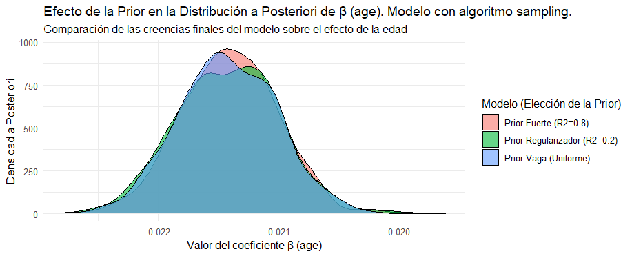
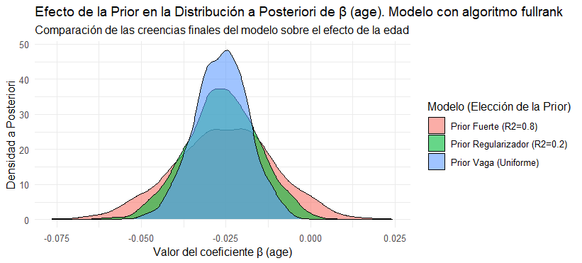
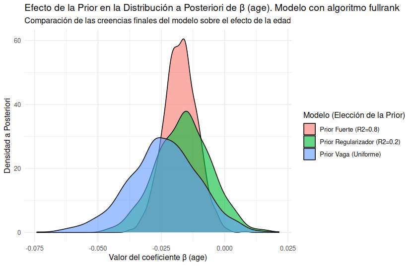

```{r setup, include=FALSE}
knitr::opts_chunk$set(echo = TRUE)

```

### Ejercicio 1
Se dividió el conjunto de datos en entrenamiento y prueba conservando la proporción original de respuestas en ambas particiones. Además, se filtraron los casos con edad mayor a 100 años, ya que en los ejercicios posteriores las predicciones basadas en edades tan extremas carecerían de representatividad.

### Ejercicio 2

Elegimos Q43: I think a natural disaster would be kind of exciting.

### Ejercicio 3

Una regresión lineal asume que las diferencias entre los distintos niveles de la variable Q (por ejemplo, "en desacuerdo", "neutral", "de acuerdo") son iguales y medibles. Esto no es corresponde para variables ordinales: aunque las categorías tienen un orden, no podemos asumir que la distancia entre "en desacuerdo" y "neutral" sea la misma que entre "neutral" y "de acuerdo". Por ejemplo, es intuitivo pensar que una opinión "neutral" está más cerca de "en desacuerdo" que de "de acuerdo", pero la regresión lineal no puede capturar esa asimetría.

Por otra parte, una regresión multinomial no asume equidistancia entre las categorías, pero si pierde la relación ordinal que queremos capturar.


### Ejercicio 4

La Regresión Ordinal modela una variable continua que representa el "nivel verdadero" de lo que estamos midiendo, y agrega también el modelado de umbrales que determinan que tramos de la variable continua pertenecen a qué categorias. De esta manera, se resuelve el supuesto de la regresión lineal de que las categorías son equisdistantes.

En otras palabras, el modelo estima tanto los coeficientes de los predictores como los puntos de corte que separan las categorias.

Para encontrar el estimador se construye una función de verosimilitud basada en las probabilidades acumuladas de que una observación caiga en cierto rango. Esto permite respetar el orden natural de las categorias.


### Ejercicio 5

El modelo estimado presenta una predicción completamente sesgada hacia la clase 1. Esto se refleja en la matriz de confusión, donde todas las predicciones corresponden exclusivamente a la clase 1

```{r echo=FALSE, message=FALSE}
library(knitr)
library(kableExtra)
library(magrittr)  # <- necesaria para %>%

cm <- matrix(
  c(23331,  8892,  8321, 13109,  9793,
       0,      0,     0,     0,     0,
       0,      0,     0,     0,     0,
       0,      0,     0,     0,     0,
       0,      0,     0,     0,     0),
  nrow = 5, byrow = TRUE
)

# Ponemos nombres de fila y columna
rownames(cm) <- paste0("Predicho: ", 1:5)
colnames(cm) <- paste0("Real: ",     1:5)

# Creamos la tabla con kableExtra
kable(cm, 
      caption = "Matriz de Confusión: Predicho vs. Real (Observado)",
      align = "c") %>%
  kable_styling(bootstrap_options = c("striped", "hover", "condensed")) %>%
  add_header_above(c(" " = 1, "Observado" = 5), bold = TRUE) %>%
  column_spec(1, bold = TRUE)

```

El summary del modelo es el siguiente

```
polr(formula = Q43 ~ age, data = train, Hess = TRUE)

Coefficients:
       Value Std. Error t value
age -0.02141  0.0004131  -51.83

Intercepts:
    Value     Std. Error t value  
1|2   -1.0465    0.0105  -100.1188
2|3   -0.4754    0.0103   -46.2390
3|4    0.0706    0.0103     6.8850
4|5    1.2014    0.0108   111.7084

Residual Deviance: 769420.10 
AIC: 769430.10 
```

Donde podemos ver que el coeficiente ajustado para la variable *age* es de -0.021 (osea que a medida que la edad crece, las logs odds nos sube la probabilidad de que la respuesta sea mas baja, osea tendiendo a 1)

### Ejercicio 6

La probabilidad estimada de que una persona de 25 años esté al menos de acuerdo con la afirmación "me gustan las armas" fue de 0.35, según el modelo de regresión ordinal ajustado.

Adicionalmente, se calculó un estimador a partir de la proporción observada en los datos, obteniendo el mismo valor de 0.35.


### Ejercicios 7 y 8
Implementación realizada en código.

### Ejercicio 9

```{r echo=FALSE, message=FALSE}
library(knitr)
library(kableExtra)

# Crear tabla de resultados
loss_df <- data.frame(
  Modelo   = c("Ordinal", "Linear (sigmoid)", "Linear (truncated)"),
  Accuracy = c(0.368, 0.155, 0.132),
  Loss     = c(1.64, 2.36, 1.37)
)

# Mostrar tabla
suppressWarnings({
  kable(loss_df, caption = "Comparación de desempeño entre modelos") %>%
    kable_styling(bootstrap_options = c("striped", "hover", "condensed"))
})
```

Si bien el modelo de regresión ordinal obtiene la mayor **accuracy** (0.368), también presenta una pérdida promedio (**loss**) relativamente alta (1.64). En contraste, el modelo lineal truncado, aunque alcanza la menor accuracy (0.132), obtiene el **menor valor de pérdida (1.37)**.

Esta diferencia se debe a la naturaleza de ambas métricas:

- La **accuracy** mide únicamente la proporción de predicciones correctas exactas, sin tener en cuenta cuán lejos están las predicciones incorrectas del valor real.
- En cambio, la **loss** utilizada penaliza la **distancia** entre el valor predicho y el verdadero, lo cual resulta más apropiado para el contexto de **regresión ordinal**, donde las clases poseen un orden natural.

Por esta razón, aunque el modelo ordinal parece más preciso a primera vista, el modelo lineal truncado puede considerarse preferible si el objetivo es **minimizar errores ordinales** en términos de distancia.

### Ejercicio 10

Para ajustar el modelo de regresión ordinal bayesiano, exploramos dos enfoques. El primer enfoque utilizó el algoritmo de muestreo por defecto, que es una variante de Monte Carlo vía Cadenas de Markov (MCMC). El segundo enfoque empleó el algoritmo fullrank, que realiza una aproximación variacional para obtener la distribución a posteriori.


```{r plot_sampling, echo=FALSE, fig.cap="Comparación Distribuciones usando MCMC con 253190 muestras"}

```
```{r plot_fullrank, echo=FALSE, fig.cap="Comparación Distribuciones usando fullrank con 253190 muestras"}

```

Mientras que el algoritmo MCMC produjo distribuciones a posteriori prácticamente idénticas para las tres priors analizadas, el algoritmo fullrank demuestra en una mayor diferenciación entre ellas. Esto sugiere que la elección del método de aproximación puede influir en la sensibilidad del modelo a la especificación de la prior.

Incorporamos un tercer enfoque para explorar la posible sobrerepresentación de ciertos valores en los datos. Dado que estamos analizando la variable edad, que se encuentra en un rango de [13, 100], y contamos con 250.000 observaciones, optamos por reducir la muestra a 50.000 casos manteniendo la misma distribución. Esta estrategia la adoptamos para que el modelo stan_polr le otorgue menos peso al componente frecuentista (la verosimilitud) y mayor peso a la prior, permitiendo así observar con mayor claridad el efecto de diferentes especificaciones previas sobre los resultados.

```{r plot_fullrank_subsampled, echo=FALSE, fig.cap="Comparación Distribuciones usando fullrank con 50000 muestras"}

```