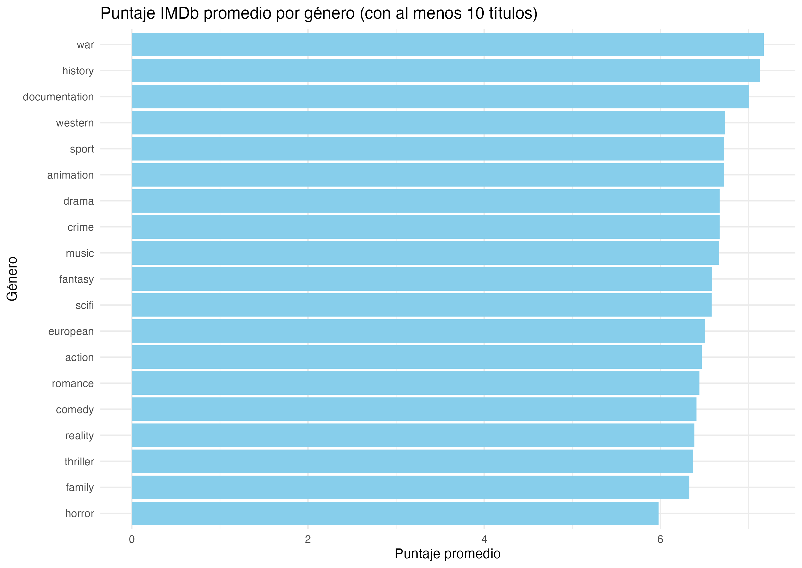
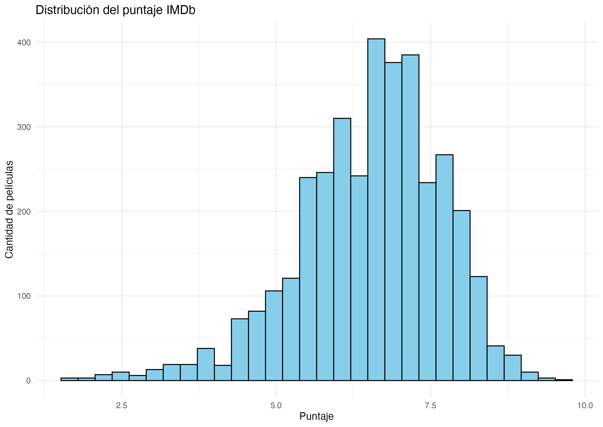
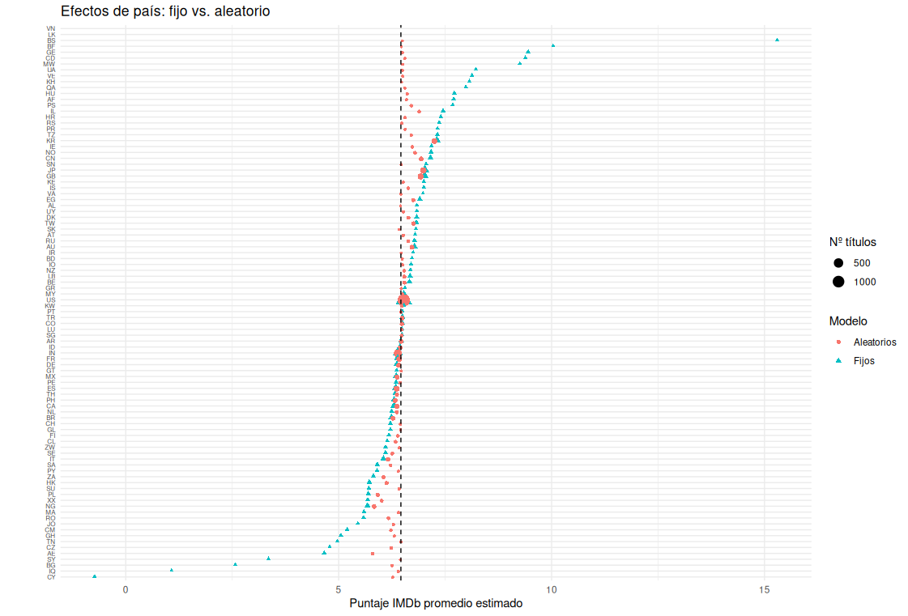
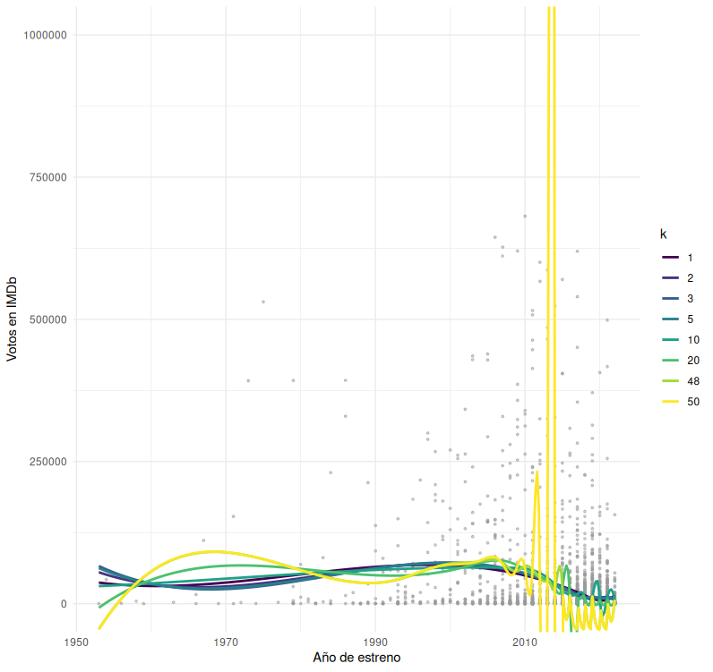

## Consigna 1

En el análisis incluimos los puntajes promedios por género, las palabras asociadas a puntajes más altos/bajos, los países con más/menos cantidad de peliculas y la distribución de los puntajes.



```{r, echo=FALSE}
library(knitr)

word_scores_hardcoded <- data.frame(
  word = c("monty", "python", "age", "table", "twenty", 
           "heaven", "earth", "tokyo", "jim", "miss"),
  mean_score = c(8.06, 8.05, 7.95, 7.88, 7.88, 7.8, 7.65, 7.6, 7.57, 7.55)
)

kable(word_scores_hardcoded, caption = "Palabras asociadas con mayor puntaje promedio")
```

```{r, echo=FALSE}
library(knitr)

word_scores_low <- data.frame(
  word = c("monsters", "holiday", "wave", "journey", "african",
           "hard", "mr", "kill", "dance", "main"),
  mean_score = c(5.58, 5.54, 5.53, 5.45, 5.43, 5.4, 5.26, 5.2, 5.04, 4.83)
)

kable(word_scores_low, caption = "Palabras asociadas con menor puntaje promedio")
```

```{r, echo=FALSE}
library(knitr)

top_5 <- data.frame(
  País = c("Estados Unidos", "India", "Reino Unido", "Japón", "Francia"),
  `Cantidad de películas` = c(1611, 432, 261, 203, 174)
)

kable(top_5, caption='Paises con más peliculas')
```

```{r, echo=FALSE}
library(knitr)

one_movie <- data.frame(
  País = c("Afganistán", "Albania", "Burkina Faso", "Bahamas", 
           "República Democrática del Congo", "Chipre", "Groenlandia", 
           "Guatemala", "Croacia", "Irak"),
  `Cantidad de películas` = rep(1, 10)
)

kable(one_movie, caption='Paises con una sola película')
```



------------------------------------------------------------------------

## Consigna 2

### 2.1

> *Plantear un modelo de efectos fijos para predecir el puntaje de IMDB únicamente en función del paı́s de origen.*

``` r
lm(imdb_score ~ . - 1, data = df)
```

### 2.2

> *Plantear un modelo de efectos aleatorios para predecir el puntaje de IMDB únicamente en función del paı́s de origen.*

``` r
lmer(imdb_score ~ 1 + (1 | country), data = df, weights = w)
```

### 2.3

> *Mostrar las estimaciones de los efectos de ambos modelos en un mismo gráfico e interpretar cómo se diferencian.*



Dada la naturaleza de ambos modelos (efectos fijos y aleatorios), es de esperar que los promedios estimados varien. Si un país produjo pocas películas, bajo el modelo de efectos aleatorios, la estimación se verá más influida por la media general que por la media específica del país. En cambio, para el modelo de efectos fijos, la estimación para cada país se basa directamente en el promedio observado del mismo, sin considerar la cantidad de datos disponibles.

Cuando comparamos, por ejemplo, Sri Lanka (LK) con solo una película en el conjunto:

El modelo de efectos fijos (triángulo) asigna exactamente el rating de esa única pelicula, quedando muy alejado de la media global.

El modelo de efectos aleatorios (círculo) achica esa estimación hacia la media global (línea punteada), pues reconoce que con tan poca información es peligroso confiar plenamente en un valor extremo.

En cambio, para un país con muchas películas (como US), ambos puntos efecto fijo y efecto aleatorio coinciden y se sitúan por encima de la media, reflejando que hay suficiente evidencia para estimar con precisión su valor real. De ese modo, los efectos aleatorios actúan como un balance entre la media global y la media de cada país, ponderando cuánto “creer” en los datos propios según su tamaño de muestra.

------------------------------------------------------------------------

## Consigna 3

> *Usando únicamente la variable release year, predecir la popularidad de cada tı́tulo (usando un tipo de modelo que crea adecuado) con un spline cúbico. Usar k = 1, 2, 3, 5, 10, 20, 50 nodos fijando el λ (penalización de rugosidad) en 0, y comparar todas las curvas estimadas en un mismo gráfico.*



Podemos ver como un número muy grande de *knots* con λ = 0 (sin penalización) convierte la base de splines en una regresión polinómica de altísimo grado: se adapta a cada *outlier* y ruido de la muestra, pierde capacidad de generalizar y genera artefactos en regiones con pocos puntos.

Se podría probar incrementar la penalización para que no se dispare la regresión en areas de poca densidad de puntos.

------------------------------------------------------------------------

## Consigna 4

> *A qué subconjunto de las variables Año, Duración y Paı́s de debe condicionar para estimar el efecto causal promedio de la variable Comedia sobre el Score? Dar todas las posibilidades.*

Para poder estimar el efecto causal de una variable X por sobre Y hay que primero eliminar todo tipo de asociación que pueda existir entre estas variables (todo tipo de relación subyacente que pueda estar ocurriendo por detrás que explique la variable Y que no se trate del efecto de X).

Para eliminar esas asociaciones lo que se puede hacer es *condicionar* a X bajo un cierto subconjunto de variables que fije el efecto de variables exógenas. Esto se hace de la siguiente manera:

1.  Copiamos el DAG original pero le sacamos las aristas que *salen* de **Comedia**.
2.  Identificamos todos los *caminos* que existan entre **Comedia** y **Score**.
3.  Construimos todos los posibles subconjuntos que garanticen una d-separación entre **Comedia** y **Score** (o análogamente que bloqueen todo camino entre ellos).

### DAG modificado

```{r dag, echo=FALSE, message=FALSE}
library(DiagrammeR)

grViz("
digraph {
  node [
    shape = circle
    width = 0.5
    fixedsize = true
    fontsize = 8
  ]

  Duracion [label = \"Duración\"]
  Comedia
  Pais     [label = \"País\"]
  Ano      [label = \"Año\"]
  Score

  Duracion -> Score
  Pais     -> Duracion
  Pais     -> Comedia
  Ano      -> Duracion
  Ano      -> Score
}
")

```

### Caminos entre **Comedia** y **Score**

Notamos los caminos:

$$\text{Comedia} \leftarrow \text{Pais} \rightarrow \text{Duracion} \rightarrow \text{Score}$$

Y

$$\text{Comedia} \leftarrow \text{Pais} \rightarrow \text{Duracion} \leftarrow \text{Ano} \rightarrow \text{Score} $$

### *d-separacion* de caminos 1 y 2

Como ya dijimos basta con bloquear ambos caminos luego, para el camino 1 basta bloquear con {Pais} para satisfacer la condicion de "En el camino hay un nodo $w \in Z = \{\text{Pais}\}$ tal que w es es el nodo central de una cadena o de un confounder" (efectivamente Pais es confounder).

En el camino 2 vemos que sucede lo mismo con tomar {Pais} pero tambien sirve bloquear por {Pais, Ano} ya que este ultimo tambien actua de confounder.

Observacion: No podemos condicionar Duracion ya que en el DAG original Duracion es hijo de Comedia y no podemos condicionar una variable que sea descendiente de nuestro "tratamiento" (Variable comedia).

Finalmente basta con condicionar a **Score** por Pais o por Pais y año. Intuitivamente podemos ver que tiene sentido pensar que dependiendo el país, los niveles de comedia pueden ir afectando el score, pero si dejamos fijo un país, luego ya depende unicamente del nivel de comedia de ese país. La inclusión o no del año en la condición la podemos ver como un extra ya que a lo sumo explica una parte del efecto causal pero no invalida el efecto de comedia como si lo hace país.

------------------------------------------------------------------------

## Consigna 5

> *Dividir al conjunto de datos en entrenamiento y testeo (tambien puede usar otra técnica, como validación cruzada). Con todas las variables que tiene disponibles, probar al menos 3 modelos diferentes y elegir el que minimice el error cuadrático médio de predicción para el rating de IMDB.*

Para este ejercicio, agregamos 2 columnas con informacion del dataset de actores: cantidad de actores y cantidad de directores.

Luego, dividimos los datos en un conjunto de entrenamiento (80% de los datos) y otro de validacion (20% restante).

Finalmente, entrenamos 3 modelos distintos sobre el conjunto de entrenamiento:

1.  Modelo de Efectos Fijos
2.  Modelo de Efectos Aleatorios
3.  Modelo GAM (Splines)

Estos son los resultados que obtuvimos:

```{r, echo=FALSE}
my_list <- list(
  row1 = c("Efectos Fijos", "Efectos Aleatorios", "Splines"),
  row2 = c(0.8711707, 0.9023391, 0.8099956)
)

df <- data.frame(
  Modelo = my_list$row1,
  MSE = my_list$row2
)

knitr::kable(df, caption = "MSE de los modelos evaluados")

```

------------------------------------------------------------------------

## Consigna 6

> *A partir del modelo elegido en el item anterior, producir un archivo predicciones.csv que tenga una sola columna que contenga, en la fila i, la predicción del rating de IMDB para el tı́tulo de la fila i.*

------------------------------------------------------------------------

## Referencias

-   Clases Teoricas\
-   Introduction to Causal Inference, Brady Neal
